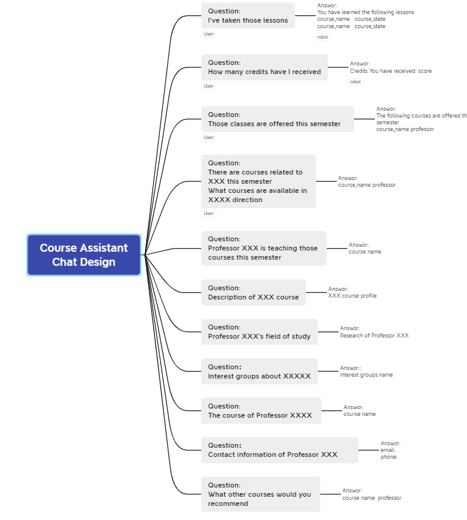

Course Assistant Design Report

#### 1、Project Motivation

​        本APP设计为那些新学期选课的同学，提供界面友好选课助手。通过chatbot一次次的对话引导同学发现自己真正需要和喜欢的课程，并在选课的过程中找到兴趣相同的朋友及兴趣小组。

#### 2、Features

​	利用wit.ai nlp训练与选课相关的问题与短语，实现选课chatbot，以达到人机界面友好的course assistant

#### 3、程序的结构

#### 4、对话流程设计

1）chat flow

2）chat design

#### 5  数据库表设计

##### 1）、td_user

##### 2）、td_my_course

##### 3）、td_course

##### 4）、td_frofessor

##### 5）、td_friends

#### 6 程序功能模块

##### 1）登录

用户使用app之前必须先登录，以便得到用户的相关信息

##### 2) 注册

新使用app的用户必须先注册用户的相关信息，以便登录app

##### 3）我的课程信息填写

填写登录用户的基本课程信息，以方便后续在chatbot中查看，及挖掘出将要选择的课程

##### 4）好友信息查看

chatbot中发现兴趣相同的好友后，此页面可以查看好友的姓名及联系方式

##### 5）course assistant

​        course assistant 将用户的问题发送到wit.ai,并获取该条语句的intent，程序以策略模式解析不同的intent

生成各自的sql语句，查询数据库，获得的结果以策略模式，根据不同的场景生成自然语言，并显示到chatbot中。

#### 7 已完成的功能

##### 1）、数据库表设计

已完成

##### 2）、注册

完成

##### 3）、登录

完成

##### 4）、my course

完成

##### 5）、my friends

完成

##### 6）、course assistant  

- 对话框架  已完成

- witai返回结果，以策略模式解析  已完成

- 后台扫描好友及好友选课  已完成

- 数据库返回结果，以策略模式解析并显示 已完成
- chatbot 基本对话流程设计  已完成

#### 8 下一步工作

1）完善对话流程设计

2）wit.ai nlp 训练以获取更精准的intent

